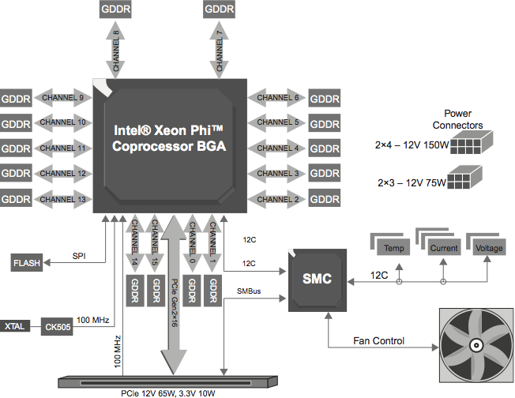
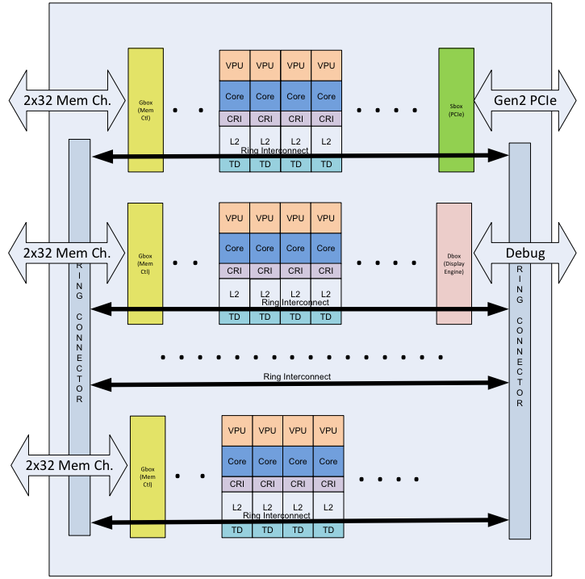
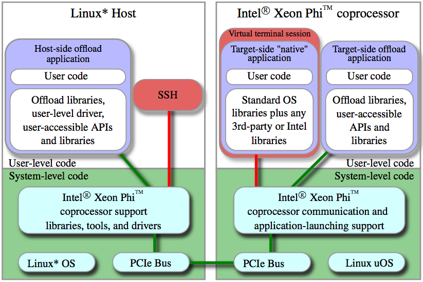
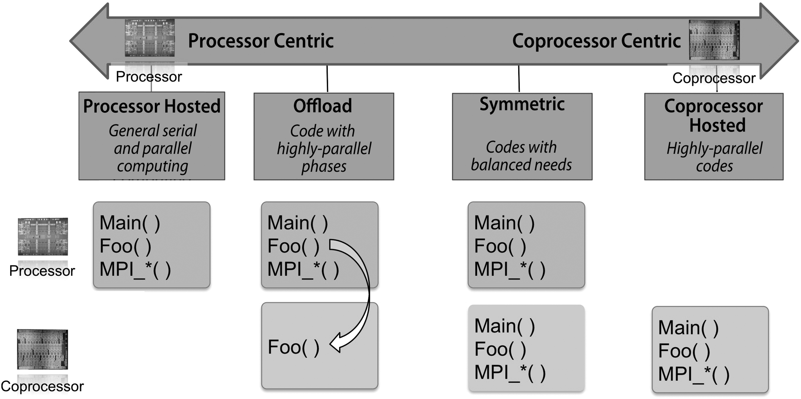

<a name="top"></a>

# 4rd International Summer School on INtelligent Signal Processing for FrontIEr Research and Industry

## Lab Workbook - Session 1

**January 2017**

UNESP Center for Scientific Computing (an Intel Modern Code Partner)  
São Paulo State University (Universidade Estadual Paulista - UNESP)

São Paulo, Brazil

**Organized by: Rogério Iope, Silvio Stanzani, Raphael Cóbe, Jefferson Fialho**

______

## Overview

Intel® Xeon Phi™ is a brand name for all Intel Many Integrated Core (MIC)
architecture of processors and coprocessors developed by Intel to enable
performance gains for highly parallel computing workloads. Intel MIC architecture
combines many Intel processor cores onto a single chip and provides interesting
and appealing features, including the ability to use familiar programming models
such as OpenMP and MPI in much the same manner that they are used on
multi-core / multi-socket systems based on widely used Intel Xeon processors.

This hands-on training has been designed to be a comprehensive, practical
introduction to parallel programming based on the Xeon Phi architecture
and programming models, aiming to demonstrate the processing power of
the Intel Xeon Phi product family. Attendants of these training activities
will start issuing simple command-line tools to get basic information about
the Intel Xeon Phi coprocessors, then learn how to monitor what resources
are being used and access their operating systems by establishing ssh
sessions with them. They will thus verify that the Intel Xeon Phi
coprocessor is an IP-addressable PCIe device - managed by an independent
environment provided by the MIC Platform Software Stack (MPSS) - that
runs a Linux-based operating system.

Following the introductory part, participants will learn how to compile
and run simple C/C++ applications directly into the coprocessors, and then
compile and run example codes based on shared-memory parallelism with OpenMP
and Cilk Plus and distributed-memory parallelism with MPI. They will also
work on MPI application examples that should be executed simultaneously
on the Xeon processors and the Xeon Phi coprocessors, explore the use of Intel
libraries TBB and MKL, and develop insights on tuning parallel applications.

Participants will have access to a heterogeneous computing system equipped
with Intel Xeon processors and Intel Xeon Phi coprocessors, as well as the
latest Intel software development tools. The computing system is hosted at
the Center for Scientific Computing of the São Paulo State University (UNESP),
in Brazil, an official member of the Intel Modern Code training program.
The step-by-step hands-on activities have been planned to provide easy to
follow instructions in order to allow the participants to have a real
experience on using a powerful manycore computing system.

## Learning Goals

Attendants of these hands-on labs will work on predefined sets of exercises
that progressively help them get familiar with the Intel Xeon Phi coprocessor
hardware, programming models and development tools. Exercises have been
developed in such a way that the learners proceed from one topic to the next
at their own speed. Participants will start issuing simple command-line
tools to get basic information about the Intel Xeon Phi coprocessors,
then will learn how to monitor what resources are being used and access
their operating systems by establishing ssh sessions with them. Trainees
will thus verify that the Intel Xeon Phi coprocessor is an
IP-addressable PCIe device - managed by an independent environment
provided by the MIC Platform Software Stack (MPSS) - that runs the Linux
operating system.

Following the introductory part, participants will learn how to compile
and run simple C/C++ applications directly into the coprocessors, and
then compile and run example codes based on shared-memory parallelism
with OpenMP and Cilk Plus and distributed-memory parallelism with MPI.
They will also work on MPI application examples that should be executed
simultaneously on the Xeon® processors and the Xeon Phi coprocessors,
explore the use of Intel Math Kernel Library (MKL), and develop insights
on tuning parallel applications.

## Before you start

Please read through the following excerpt, extracted from the white
paper referenced below, which will give you a short overview of the
Intel Xeon Phi coprocessor.

A. Vladimirov, V. Karpusenko, “*Test-driving Intel® Xeon Phi™ coprocessors with
a basic N-body simulation*”, Colfax International, January 2013, available at

<http://research.colfaxinternational.com/post/2013/01/07/Nbody-Xeon-Phi.aspx>

We will refer again to this white paper later on in this training.

______

## Navigation

This course is divided into four parts:

* [Practical Exercises - **Part 1**: Introduction to the Intel® Xeon Phi™ coprocessor](#part1)
* [Practical Exercices - **Part 2**: Compiling and running trivially simple applications](#part2)
* [Practical Exercices - **Part 3**: High Performance Test-Drive](#part3)
* [Practical Exercices - **Part 4**: Running a basic N-body simulation](#part4)

______

## What Intel® Xeon Phi™ coprocessors bring to the table

Intel® Xeon Phi™ coprocessor is a symmetric multiprocessor in the form
factor of a PCI express device. Intel’s James Reinders has defined the
purpose of Intel® Xeon Phi™ coprocessors in the following way[^1]: “*Intel®
Xeon Phi™ coprocessors are designed to extend the reach of applications
that have demonstrated the ability to fully utilize the scaling
capabilities of Intel Xeon® processor-based systems and fully exploit
available processor vector capabilities or memory bandwidth.*” It cannot
be used as a stand-alone processor. However, up to eight Intel® Xeon Phi™
coprocessors can be used in a single chassis[^2]. Each coprocessor
features more than 50 cores clocked at 1 GHz or more, supporting 64-bit
x86 instructions. The exact number of cores depends on the model and the
generation of the product. These in-order cores support four-way hyper-
threading, resulting in more than 200 logical cores. Cores of Intel® Xeon
Phi™ coprocessors are interconnected by a high-speed bidirectional ring,
which unites L2 caches of the cores into a large coherent aggregate
cache over 25 MB in size. The coprocessor also has over 6 GB of onboard
GDDR5 memory. The speed and energy efficiency of Intel® Xeon Phi™
coprocessors comes from its vector units. Each core contains a vector
arithmetics unit with 512-bit SIMD vectors supporting a new instruction
set called Intel Initial Many-Core Instructions (Intel IMCI). The Intel
IMCI includes, among other instructions, the fused multiply-add,
reciprocal, square root, power and exponent operations, commonly used in
physical modeling and statistical analysis. The theoretical peak
performance of an Intel® Xeon Phi™ coprocessor is 1 TFLOP/s in double
precision. This performance is achieved at the same power consumption as
in two Intel Xeon® processors, which yield up to 300 GFLOP/s.

In order to completely utilize the full power of Intel® Xeon Phi™
coprocessors (as well as Intel Xeon-based systems), applications must
utilize several levels of parallelism:

1.  task parallelism in distributed memory to scale an application
    across multiple coprocessors or multiple compute nodes,

2.  task parallelism in shared memory to utilize more than 200 logical
    cores,

3.  and at last, but definitely not the least, - data parallelism to
    employ the 512-bit vector units.

The novelty of developer experience in Intel® Xeon Phi™ coprocessor is the
continuity of the programming model between Xeon® processor and Xeon Phi™
coprocessor programming:

1.  The same C, C++ or Fortran code can be compiled into applications
    for Intel Xeon® processors and Intel® Xeon Phi™ coprocessors.
    Cross-platform porting is possible with only code re-compilation.

2.  The same parallel frameworks are supported by the Intel Xeon® and
    Intel® Xeon Phi™ architectures. MPI can be used to scale in
    distributed or shared memory with Intel® Xeon Phi™ coprocessors acting
    as individual cluster nodes. OpenMP, Intel Cilk Plus, Intel
    Threading Building Blocks, and other shared memory frameworks can be
    used to split the work homogeneously between the processor or
    coprocessor cores. The Intel Math Kernel Library provides highly
    optimized standard functions for both platforms.

3.  The same software development tools can be used for both platforms:
    Intel compilers, Intel VTune Parallel Amplifier XE to profile and
    optimize the applications, Intel Debugger and Intel Inspector to
    diagnose critical and logical issues.

4.  Similar optimization methods benefit applications on both platforms.

**Useful References**

-   _Intel® Xeon Phi™ Coprocessor High-Performance Programming, by Jim Jeffers and James Reinders (Elsevier, 2013)_    
    <http://www.lotsofcores.com/>

-   _Intel® Xeon Phi™ Coprocessor Architecture and Tools, by Rezaur Rahman (Apress, 2013)_
    <http://www.apress.com/9781430259268>

-   _Intel® Xeon Phi™ Coprocessor High-Performance Programming Volume two, by Jim Jeffers and James Reinders (Elsevier, 2015)
    <http://www.lotsofcores.com/>

-   Intel® Xeon Phi™ Coprocessor High-Performance Programming Volume three, by Jim Jeffers and James Reinders (Elsevier, 2016)
    <http://www.lotsofcores.com/>

-   _Parallel Programming and Optimization with Intel® Xeon Phi™ Coprocessors, 2nd Edition (Colfax, 2015)_
    <http://www.colfax-intl.com/nd/xeonphi/book.aspx>

-   _An Overview of Programming for Intel Xeon® processors and Intel® Xeon Phi™ coprocessors_
    <http://software.intel.com/sites/default/files/article/330164/an-overview-of-programming-for-intel-xeon-processors-and-intel-xeon-phi-coprocessors.pdf>

-   _Intel® Xeon Phi™ Coprocessor Developer´s Quick Start Guide_
    <http://software.intel.com/sites/default/files/article/335818/intel-xeon-phi-coprocessor-quick-start-developers-guide.pdf>

-   _Intel C++ Compiler XE 13.1 User and Reference Guide (Linux OS)_
    <http://software.intel.com/sites/products/documentation/doclib/stdxe/2013/composerxe/compiler/cpp-lin/>

-   _Intel® Xeon Phi™ Coprocessor: System Software Developers Guide_
    <http://www.intel.com/content/www/us/en/processors/xeon/xeon-phi-coprocessor-system-software-developers-guide.html>

-   _Intel® Xeon Phi™ Coprocessor 3120A (6GB, 1.100 GHz, 57 cores)_
    <http://ark.intel.com/products/75797/Intel-Xeon-Phi-Coprocessor-3120A-6GB-1_100-GHz-57-core>

## Remote access to the testing platform

This document assumes that the testing platforms have been setup and are
ready to use. We will be using a state-of-the-art server - loaned by
Intel - with two high-end Intel Xeon processors (each with 18 cores, 2 threads/core)
and five Intel Xeon Phi coprocessors (each with 60 cores, 4 threads/core), as well
as several Intel software development tools. To simplify nomenclature,
we will refer to the testing platform as “the host” (or “the host
system”), and the Xeon Phi™ coprocessors installed in the host system as
“mic0”, “mic1”, ..., “mic4”.

Participants should work alone or in pairs on a workstation - preferably
running Linux or Mac - with Internet access. All the exercises are
command-line based and should be executed on the host system by means of
a secure shell (SSH) connection. Ideally the participant workstation
should be able to run X11.

Use the syntax below to log in to the host system.

```
$ ssh –X SERVER –l traineeN 
```

**(N is a number assigned to each participant)**


```
$ ssh –X KNL-SERVER –l traineeN 
```
**(N is a number assigned to each participant)**


Please refer to the teaching assistant(s) for more details.


## GIT repository and source files directory

**Git** is a free and open source distributed version control system (DVCS) designed to track changes in source files  or other content and coordinate work on them among multiple people with flexibility, security, and efficiency.

**GitHub** is a web-based Git repository hosting service.

To copy (clone) the remote source files repository to your user directory, run the following command in the host system console:

```
$ git clone https://github.com/intel-unesp-mcp/infieri-2017-basic.git
```

To access the source files directory run the following command:

```
$ cd infieri-2017-basic/src
```

This will be referred as your **SOURCE-DIR**.

Please refer to the teaching assistant(s) for more details.

## Intel's environment variables

After you connect to the remote server, set the environment variables necessary for the Intel development tools by running the following command:

```
[SERVER]$ source /opt/intel/parallel_studio_xe_2017.1.043/psxevars.sh intel64
```

Or

```
[KNL-SERVER]$ source /opt/intel/parallel_studio_xe_2017.1.043/psxevars.sh intel64
```

______

### Quick Navigation ###

[Top](#top "Top of the page") | [Part 1](#part1 "Introduction to the Intel® Xeon Phi™ coprocessor") | [Part 2](#part2 "Compiling and running trivially simple applications") | [Part 3](#part3 "High Performance Test-Drive") | [Part 4](#part4 "Running a basic N-body simulation") | [Bottom](#bottom "Bottom of the page")

______

<a name="part1"></a>

# Practical Exercises - Part 1 #

## Introduction to the Intel® Xeon Phi™ coprocessor ##

### 1.1 Goals ###

Activities start with a brief overview of the Xeon Phi coprocessor
hardware and software architecture, followed by a series of practical
exercises. The exercises will show you some of the tools available for
getting information about the Intel Xeon Phi coprocessors and monitor
how their internal resources are being used. You will have an
introductory contact with the essential tools and configuration options
for managing the coprocessor operating environment.

### 1.2 Overview of the Xeon Phi™ hardware architecture ###

Intel® Xeon Phi™ coprocessors have been designed as a supplement to the
Intel Xeon® processor family. These computing accelerators feature the
MIC (Many Integrated Core) architecture, which enables fast and
energy-efficient execution of High Performance Computing (HPC)
applications utilizing massive thread parallelism, vector arithmetic and
streamlined memory access. The term “Many Integrated Core” is used to
distinguish the Intel Xeon Phi product family from the “Multi-Core”
family of Intel Xeon processors.

The Xeon Phi card can be thought of as a computer board containing the
coprocessor silicon chip with up to 61 cores and their associated caches
and memory controllers, which is in turn surrounded by GDDR5 memory
chips, a flash memory, a system management controller, sensors, and
miscellaneous electronics and connectors to attach it into a host
computer system. The whole coprocessor card is what is commonly just
called the Xeon Phi coprocessor. A schematic view of the key components
of the coprocessor card is shown in Figure 1. The flash memory is used
to store the coprocessor bootstrap code, similar to the BIOS in an Intel
Xeon® processor platform. The System Management Controller (SMC) handles
information coming from sensors that measure temperature, voltage, and
current. The different Xeon Phi coprocessor models vary on such factors
as number of cores, memory size and speed, thermal solutions and form
factor.



**Figure 1: Intel® Xeon Phi™ coprocessor card schematic**

At a high level, the coprocessor silicon chip consists of up to 61
processor cores based on the Intel Pentium architecture (P54C[^3]) with
several improvements - including Intel64 instruction set architecture,
4-way symmetric multithreading, new vector instructions, and increased
cache sizes -, interconnected by a high performance on-die bidirectional
interconnect. Each core is a fully functional, in-order processing unit
supporting fetch-decode-execute instruction cycles from four hardware
thread execution contexts.

Figure 2 shows a simple diagram of the logical layout of some of the
critical chip components of the Intel® Xeon Phi™ coprocessor architecture.
As can be seen in Figure 2, each core includes:

-   a 512 bit wide vector processor unit (VPU), capable of performing
    512-bit vector operations on 16 single-precision or 8
    double-precision floating-point arithmetic operations as well as
    integer operations;

-   the Core Ring Interface (CRI), which connects each core to
    corresponding special controllers called Ring Stops that insert
    requests and receive responses on/to the ring;

-   the L2 cache (including the tag, state, data and LRU arrays) and the
    L2 pipeline and associated arbitration logic;

-   the Tag Directory (TD), which is a portion of the distributed tag
    directory infrastructure for cross-snooping L2 caches in all cores;
    the L2 caches are kept fully coherent with each other by the TDs,
    which are referenced after an L2 cache miss.



**Figure 2: Basic building blocks of the Intel® Xeon Phi™ coprocessor
chip**

In addition to the IA (Intel Architecture) cores, the Xeon Phi
coprocessor chip also includes:

-   Memory controllers (GBOX), which access external memory devices
    (local physical memory on the coprocessor card) to read and write
    data; each memory controller has 2 channel controllers, which
    together can operate two 32-bit memory channels;

-   a Gen2 PCI Express client logic (SBOX), which is the system
    interface to the host CPU or PCI Express switch, supporting x8 and
    x16 configurations;

-   a debug display engine (DBOX) comprised by a set of registers that
    can be accessed for debugging purposes;

-   the Ring Interconnect that connects all of the aforementioned
    components together on the chip.

Each memory controller is based on the GDDR5 specification, and supports
two channels per memory controller. At up to 5.5 GT/s transfer speed,
this provides a theoretical aggregate bandwidth of 352 GB/s (gigabytes
per second) directly connected to the Intel® Xeon Phi coprocessor.

For more detailed information please refer to ”Intel® Xeon Phi™
Coprocessor: System Software Developers Guide".

### 1.3 Overview of the Xeon Phi™ system software and programming models ###

The Intel Xeon Phi coprocessor needs support from system software
components to operate properly and interoperate with other hardware
components in a system. The system software component of the Xeon Phi
coprocessor, known as the Intel Many Integrated Core (MIC) Platform
Software Stack (MPSS), provides this functionality. When installing
coprocessors for use in an Intel Xeon processor platform for the first
time, an early step that needs to be done is to download, install, and
launch the latest version of Intel MPSS.

The MPSS provides tools and utilities that allow the platform user to
query the coprocessors’ status. The utilities run on the host system at
the user level and goes through the system drivers to communicate with
the corresponding software piece on the coprocessor in order to retrieve
system information such as core and memory utilization, core
temperature, and power received from the system management component and
controller (SMC) hardware on the coprocessor system.

There are thus two major components that comprise the software structure
used to build and run applications and system services that utilize the
Xeon Phi™ coprocessor:

-   Development tools and runtime libraries: the development tools and
    associated runtime services and libraries are provided by tool
    packages such as the Intel Parallel Studio XE 2013 and the Intel
    Cluster Studio 2013. The Intel C/C++ Intel Fortran compiler, and
    Intel MPI library are some of the sub-components of these
    development tools packages.

-   Intel Manycore Platform Software Stack (MPSS): the operational
    software specific to the coprocessor including middleware interfaces
    used by the development tools, device drivers for communication and
    control, coprocessor management utilities, and the coprocessor’s
    local Linux operating system.

Unlike other device drivers implemented to support PCI Express based
hardware, such as graphics cards, Intel Xeon Phi was designed to support
the execution of computing applications in the familiar HPC environment
through the OpenMP and MPI specifications, as well as other offload
programming usage models. Because the coprocessor core is based on the
traditional Intel P5 processor core, it can execute a complete operating
system like any other computer. The disk drive is simulated by a RAM
drive and supports an Internet protocol (IP)-based virtual socket to
provide networking communication with the host. This design choice
allows the coprocessor to appear as a node to the rest of the system and
allows a usage model common in the HPC programming environment. The
operating system resides on the coprocessor and implements complementary
functionalities provided by the driver layer on the host side to achieve
its system management goals.

The software stack of the Xeon Phi is then highly layered, split up into
a host side and a coprocessor side. Host system and Xeon Phi coprocessor
are both (typically) running Linux operating systems and they are
connected through the PCI Express bus. On both sides, various layers of
kernel and user level drivers, libraries, and runtimes can be found. For
ease of use, a virtual network interface is implemented on top of the
PCI Express connection.

Figure 3 shows a block diagram of the key components that comprise the
coprocessor software architecture. As can be seen, the diagram shows
well-defined left and right sides, and a solid line divides each of them
in top and bottom halves. The left side corresponds to components on the
host processor platform and the right side depicts software components
on the Xeon Phi coprocessor. The top and bottom halves represent the
standard operating system notion of hierarchical protection domains[^4]:
application code and system interface executes at the user-level, and
more trusted, system level operating system and driver code runs at the
kernel level. The application layer uses runtime libraries to provide
the communication and control necessary to send the code and data to the
coprocessor and get the results back. The application layer also
contains utilities and libraries that can be used to query the system
status and allow socket communications and other communication supports
(such as InfiniBand protocols). The application layer is built on top of
the system software running at the kernel level (the most protected mode
of operation of the processor, where the OS kernel and drivers usually
run) on both the host and the coprocessor card[^5]. The network traffic
is carried over the PCIe bus instead of network interconnects.



**Figure 3: Simplified view of the Intel® Xeon Phi™ software stack**

The careful examination of the software stack represented in Figure 3
reveals two principal ways of accessing the Xeon Phi coprocessor:

-   Offload (green line): applications are started and run on the
    host processor. Selected compute-intensive and highly parallel parts
    of the application are offloaded to the coprocessor, by using a
    comprehensive set of programming language extensions and
    library routines. The process of transferring data to and execution
    code on the coprocessor is transparent to the users. Results are
    obtained on the host side, as if the application was run on the
    host only. With Compiler Assisted Offloading (CAO), the users
    explicitly control data transfer and execution with the help
    of directives.

-   Native (red line): applications can be run natively on the Xeon
    Phi coprocessors. To the applications, the coprocessor looks like a
    standalone multicore computer. Users can log in directly onto the
    Xeon Phi™ via ssh and execute applications, just as they are used to
    from the host system. Applications are compiled on the host for
    native execution on the Xeon Phi and copied over (or made available
    on a distributed filesystem exported from the host, e.g. via NFS -
    the Linux Network File System). After the computation is finished,
    the results can be retrieved from the coprocessor with the help of
    the same mechanisms.

Both models can be mixed, resulting in multiple execution scenarios:

-   Applications running on the host only;

-   Applications running mainly on the host, with critical parts of the
    code being offloaded to the Xeon Phi;

-   Applications running on both the host and the Xeon Phi, interacting
    trough standardized communication frameworks;

-   Highly parallel applications running on the Xeon Phi only.

Figure 4 illustrates the compute spectrum enabled when coupling
processors and coprocessors. Depending on the application’s compute
needs, execution can be initiated on either a host processor or on one
or more coprocessors. Depending on the application needs and system
environment, any mix of computation between the processor and
coprocessor can be chosen for optimal performance.



**Figure 4: Programming models for an Intel Xeon® platform with Xeon Phi™ coprocessors**

Included in Figure 4 is a conceptual view of how code might be launched
and executed in the key enabled programming uses. From left to right
those models are:

-   Processor-only model: the application is launched and executed only
    on the host processors;

-   Offload model: the application is launched and primarily managed on
    processors and selected portions of the code are offloaded to the
    coprocessors;

-   Symmetric model: the application is launched on both processors and
    coprocessors with cooperative communication (typically via MPI);

-   Coprocessor-only model: the application is launched and executed
    only on the coprocessors.

The Intel MPI library supports all these programming execution models.
MPI is the de facto library-based communication environment used to
enable parallel applications to run, communicate, and scale across
multiple processing cores, either between the multiple cores in a single
Intel Xeon processor platform or across a connected network of nodes in
a cluster. During the hands-on activities of Part 2 you will have the
opportunity to exercise some of these computing models.

### 1.4 Knights Landing: the Second Generation of Xeon Phi™ Architecture

Recently, a second generation of Intel Xeon Phi architecture has been released with the 
code-name Knights Landing (KNL), offering additional support for vector processing, 
power efficient scaling and local memory bandwidth. The novelties of Intel KNL are the following:

-	Increase in the number of cores: distinct KNL models have 64, 68 or 72 cores;
-	Improvement on the size of the Vector Processing Units (VPU): each core provides two units of 512 bits;
-	Improvements on the vector instruction set: KNL provides support to a new instruction set known as AVX-512, that offers new functionalities for vectorization but is fully compatible with previous versions;
-	KNL is available both as a processor or as a coprocessor, maintaining compatibility with applications compiled for the Intel Xeon;
-	An Integrated on-package High-bandwidth memory (HBM) with 16 GB based on the multi-channel dynamic random access memory (MCDRAM), that complements DDR4.

Each core of the KNL architecture has two 512-bit VPUs, L1 cache and is capable of executing 
four threads. Cores are organized in tiles, each one consisting of two cores that share a single L2 cache. 
Tiles are interconnected by a cache-coherent two-dimensional mesh network; the mesh interconnection enforces that every 
message travels to the destination first vertically, until it hits the target row, then travels horizontally until it reaches the destination. Such interconnection is specifically optimized for KNL traffic flows.
KNL has two types of memory, known as DDR4 SDRAM (double data rate fourth-generation synchronous dynamic random-access memory) and HBM (High-Bandwidth Memory). The maximum capacity for DDR4 is 384 GB and the size of HBM is 16 GB. The high-bandwidth memory can be used as a Last-level cache (LLC) or as a regular addressable memory. KNL allows three modes of configuration:

* **Flat:** memory is treated as a standard memory in same address space of DDR4;
* **Cache:** memory is used as a LLC cache for DDR4;
* **Hybrid:** a portion of memory is cache and remaining is flat;

The memory in KNL can be organized in two forms: Uniform Memory Access (UMA), in which the latency from one core to any memory location will vary little across the mesh, or Non-Uniform Memory Access (NUMA), in which memory and cores are divided into two or four sections; in this second case the latency from core to memory in the same region is lower that the latency from core to memory in other regions. KNL provides five cluster modes:  

#### • UMA
- **All-to-all:** memory addresses are uniform distributed across the chip;  
- **Quadrant:** memory addresses are divided in four sections;  
- **Hemisphere:** memory addresses are divided in two sections.   

#### • NUMA
- **SNC-2:** tiles are divided in two NUMA nodes;  
- **SNC-4:** tiles are divided in four NUMA nodes.

### 1.5 Hands-on Activities ###

**1.5.1** On your desktop/workstation, open a terminal or command line
console and use the command `ssh` to login to the host `SERVER`
as user traineeN (N = 01 … 20; please check with the teaching assistant
which number has been assigned to you):

```
$ ssh –X traineeN@SERVER
```

**1.5.2** Intel’s tool for checking the status of Xeon Phi coprocessors
is micinfo. Use this utility to obtain detailed information about the
Intel Xeon Phi coprocessor(s) installed in the system and the
corresponding driver version:

```
[SERVER]$ micinfo
```

For each device listed, take note of the device model (SKU:
*stock-keeping unit*), number of cores, memory size (GDDR5 –
<http://en.wikipedia.org/wiki/GDDR5>) and thermal information (die
temperature, actively- or passively-cooled). Check also the memory size
of the host system.

The `-listdevices` option provides a shorter output, with the list of the
Intel® Xeon Phi coprocessors available in the system:

```
[SERVER]$ micinfo -listdevices
``` 

(**Extra exercise:** compare the result with the output of `$ lspci | grep processor`).

To request detailed information about a specific device, the option
`-deviceinfo <N>` can be used. The information displayed by the
`micinfo` command can also be narrowed down by including the option `-group <group name>`, where group name can be: version, board, cores,
GDDR, thermal. For example:

```
[SERVER]$ micinfo -deviceInfo 0 -group cores
[SERVER]$ micinfo -deviceInfo 1 -group thermal
```

**1.5.3** The Xeon Phi coprocessor is packaged in a PCIe card which
includes thermal and power sensors and a system management controller
(SMC) that monitors the sensors and manages the coprocessor. The utility
micsmc can be used to extract information from the coprocessor SMC,
including core temperatures; core frequency and power usage. The utility
operates in two modes: Graphical User Interface (GUI) mode and command
line (CLI) mode. In order to invoke the GUI mode, micsmc should be
executed without any additional parameters. In this mode, the tool
provides continuously updated information on Intel® Xeon Phi™ coprocessor
core utilization, core temperature, memory usage, and power usage
statistics. If your workstation has X11 capabilities (Linux or Mac),
then issuing the micsmc command without any options will open a new
window frame on your desktop, the *Coprocessor Platform Status Panel*:

```
[SERVER]$ micsmc &
```

In the menu bar of this new window frame, select Cards, Show All and
take a look at the default card view – the *Utilization View* - for each
coprocessor. Find the view-selection buttons on the upper left corner,
which enable you to switch from the current view to one of the two other
available views: the *Core Histogram View* and the *Historical
Utilization View*. In particular, the Core Histogram View displays the
computational activity of all logical cores (*threads*), measured in
percentage utilization, of the corresponding Xeon Phi coprocessor.

To close the GUI application, type `fg` in the console and then hit ^C.
For more information, please check the documentation available at
`/opt/intel/mic/sysmgmt/docs/en_US/` (use scp to copy the pdf file to
your local desktop).

**Note:** If your workstation does not have X11, you will get the error
message: `micsmc-gui: cannot connect to X server`. Alternatively, you
can use the command below:

```
[SERVER]$ watch -n 1 micsmc -t
```

The CLI mode is activated with command-line arguments and provides the
same information as the graphical user interface, but in text form. It
is thus suitable for direct execution or for scripting. For example:

```
[SERVER]$ micsmc -c
[SERVER]$ micsmc -a
```

For a detailed view of all `micsmc` arguments, use option `–h` (for help).

**1.5.4** The miccheck utility runs a set of diagnostic tests in order
to verify the configuration of all the Intel® Xeon Phi™ coprocessors
installed in the system. By default, all available tests are run on all
Intel® Xeon Phi™ coprocessors, but a subset of tests and devices can be
selected by using adequate arguments. Let us take a look on the outcomes
of the command:

```
[SERVER]$ miccheck
```

For a detailed view of all `miccheck` arguments, use option `–h` (for help).

There are other administrative tools and utilities, but they are mostly
used for system administration purposes (e.g. updating the firmware in
the Xeon Phi coprocessor´s flash memory) and usually require
administrative privileges to run.

**1.5.5** The Intel® Xeon Phi coprocessor is an IP-addressable PCIe
device - managed by an independent environment provided by the MIC
Platform Software Stack (MPSS) - that runs the Linux operating system.
The Linux OS on the Intel Xeon Phi coprocessor supports SSH access for
all users defined, including root, using public key authentication keys.
In this activity we are going to interact with the Intel Xeon Phi
coprocessors´ Linux OS via a terminal shell. From the host shell issue
an ssh to the first coprocessor (mic0):

```
[SERVER]$ ssh mic0
```
In the coprocessor command-line shell, issue the following commands and
check the results:

```
[SERVER-MIC]$ uname –a
[SERVER-MIC]$ cat /proc/cpuinfo | grep processor | wc –l
[SERVER-MIC]$ cat /proc/meminfo | grep MemTotal
[SERVER-MIC]$ ifconfig
[SERVER-MIC]$ cat /etc/hosts
[SERVER-MIC]$ exit
```

By default, the first Intel Xeon Phi coprocessor in the system is
resolved to the hostname mic0, as specified in the file `/etc/hosts`.
Notice that the SSH server that runs on the coprocessor allows us to
transfer files from the host to the coprocessor using the secure copy
tool (`scp`). We are going to use this mechanism in the following
activities to transfer executables compiled in the host system to the
coprocessors.

Close the connection with mic0 using exit (or ^D), and repeat the
previous command sequence on the second and third coprocessors (mic1 and
mic2). Check the number of cores, the available memory, and the IP
address of the second coprocessor.

**1.5.6** Bonus: using the command `cat`, create a simple text file in the
host system, and then transfer it to one of the coprocessor cards using
`scp`. Then issue an `ssh` to the corresponding card and check the file.
Verify also if you are able to transfer the same file directly from one
coprocessor card to another one.

**1.5.7** On your desktop/workstation, open a terminal or command line 
console and use the command ssh to login to the host **KNL-SERVER** as user traineeN (N = 01 … 20; please check with the teaching 
assistant which number has been assigned to you):

```
ssh –X traineeN@KNL-SERVER
```

**1.5.8** The utility `lscpu` shows information about the CPU architecture. 
Use this utility to obtain the amount of cores and threads available on the Intel 
KNL processor installed in the system:

```
[KNL-SERVER]$ lscpu
```

**1.5.9** the utility `numactl` maps processes to specific NUMA nodes. Use this utility 
with the parameter -H to obtain information about the NUMA nodes in the system.

```
[KNL-SERVER]$ numactl -H
```

The cluster mode of the KNL server we are using has been configured as SNC-4, so cores appear grouped into 
four nodes with exactly a quarter of the on-platform memory in each node. 
In addition, our system uses the on-package high bandwidt memory (HBM) configured as flat mode, 
which adds four more NUMA nodes with a quarter of the HBM assigned for each node.

______

### Quick Navigation ###

[Top](#top "Top of the page") | [Part 1](#part1 "Introduction to the Intel® Xeon Phi™ coprocessor") | [Part 2](#part2 "Compiling and running trivially simple applications") | [Part 3](#part3 "High Performance Test-Drive") | [Part 4](#part4 "Running a basic N-body simulation") | [Bottom](#bottom "Bottom of the page")

______

<a name="part2"></a>

# Practical Exercices - Part 2 #

## Compiling and running trivially simple applications ##

### 2.1 Goals ###

Traditionally, “Hello World” programs are used to illustrate basic
syntax; most of the examples of this session will follow this tradition.
The following set of activities will show you how to compile trivially
simple source codes for native Intel Xeon Phi coprocessor execution. You
will also learn how to offload parts of the code or specific function
calls of an executable running on the host to the coprocessor, and will
have the opportunity to play with simple MPI and OpenMP examples.

### 2.1.1 Overview of Vectorization ###

The Vector Processing Units present in the cores of Intel Xeon and Intel Xeon Phi architecture (described in Section 1.2), provide support for the execution of vector instructions which operates simultaneously on a set of data items known as a vector. On the contrary, scalar instructions operate on single data items. This kind of parallelism is known as data-level parallelism. Considering the source code of an application, the best candidates to explore data parallelism are the loops with independent iterations and with a body composed by a few lines. The parallelization process of an application using data parallelism is known as **vectorization**. Compilers offer support for developers to explore vectorization in the following ways:

- Automatic vectorization: the compiler implements heuristics that change scalar instructions to vector instructions automatically, but only in cases where there is no modification on the final results.

- Guided Vectorization: when the compiler is not able to automatically vectorize the source code, the developer can use pragmas to instruct the compiler about the vectorization.

- Low level vectorization: the developer can use specific compiler libraries to develop vector code.


### 2.2 Hands-on Activities ##

**2.2.1** A development system with Intel Xeon Phi coprocessors must
have the Intel software development tools installed, such as compilers,
parallelization libraries and performance tuning utilities to support
high performance code compilation. That said, before compiling and
linking any source code, we need to be sure that 1) the host system has
the Intel C (icc) and C++ (icpc) compilers, the libraries and the
utilities we will use and 2) the environment is set up properly. In
order to verify that the compilers are installed, run the following
commands in the host system console:

```
[SERVER]$ icc -V
[SERVER]$ icpc -V
```

**2.2.2** Let us begin with an extremely trivial code just to check if
everything is running fine. Take a look at the source code `hello.c`
located at `/home/traineeN/source-files/session1`, then compile and
execute it:

```
[SERVER]$ cd ~/source-files/session1
[SERVER]$ cat ./hello.c
[SERVER]$ icc hello.c -o hello
[SERVER]$ ./hello
```
  > Hello world! I have 32 logical cores.


**Note:** All the source codes we will be using in the following
activities are located in your home directory:

```
  /home/traineeN/source-files/session1.
```

Now recompile it using the `–mmic` flag to make it natively executable for
the Intel Xeon Phi coprocessor (remember to change the name of the
executable, e.g. `hello.mic` or `hello.phi`), and try to execute it:

```
[SERVER]$ icc -mmic hello.c -o hello.mic
[SERVER]$ ./hello.mic
```

 > -bash: ./hello.mic: cannot execute binary file

The resultant binary can only be executed on the Intel Xeon Phi
coprocessor (why?). As we have seen before, the Intel Xeon Phi
coprocessor is an IP-addressable device which runs an independent Linux
OS with an SSH server daemon. Let us use scp to copy the executable
hello.mic to any of the coprocessors, for example mic0 and mic1 (and/or
mic2):

```
[SERVER]$ scp hello.mic mic0:
[SERVER]$ scp hello.mic mic1:
[SERVER]$ scp hello.mic mic2:
```

Connect to each coprocessor through ssh and execute the binary file
locally:

```
[SERVER]$ ssh mic0
[SERVER-MIC]$ ./hello.mic
```

  > Hello world! I have 240 logical cores.

```
[SERVER-MIC]$ exit
[SERVER]$ ssh mic1
[SERVER-MIC]$ ./hello.mic
```

  > Hello world! I have 240 logical cores.

```
[SERVER-MIC]$ exit
```

**2.2.3** Now we are going to run the native MIC executable in the
coprocessors from the host system, using the `micnativeloadex` utility.
It automatically copies the native binary to a specified coprocessor,
checks library dependencies and also copies them prior to execution. By
default, `micnativeloadex` redirects output from the application running
on the coprocessor back to the host system console. The output of the
application is redirected back to the console of the host system. The
location of the Intel compiler runtime libraries for Intel® Xeon Phi™
coprocessors is defined by the `SINK_LD_LIBRARY_PATH` environment
variable, so we need to set it first:

```
[SERVER]$ export SINK_LD_LIBRARY_PATH=/opt/intel/composer_xe_2013.1.117/compiler/lib/mic
[SERVER]$ micnativeloadex ./hello.mic –d 0
```

> Hello world! I have 240 logical cores.

  
```
[SERVER]$ micnativeloadex ./hello.mic –d 1
```

> Hello world! I have 240 logical cores.
 

```
[SERVER]$ micnativeloadex ./hello.mic –d 2
```

> Hello world! I have 240 logical cores.
  

The `micnativeloadex` utility can also be used to check the library
dependencies of the binary code, by using the option `–l`:

```
[SERVER]$ micnativeloadex ./hello.mic –d 0 –l
```

**Extra activity:** rebuild the code `hello.c` with the `–mmic` and `–mkl`
compiler directives, execute the previous command and identify the extra
libraries that are related to the Intel MKL.

**2.2.4** In this activity we will run three trivial Hello World
examples, aiming to demonstrate the explicit offload model. In this
programming model, execution begins on the host and, based on
user-defined code, some sections are offloaded to the coprocessor(s), if
there is one, or run in the host if not.

The first example uses the directive `#pragma offload target(mic)`,
which informs the compiler that the segment of the code immediately
below it (and delimited with brackets) should be executed on an Intel®
Xeon Phi™ coprocessor. Take a look at the content of the source file
`hello-offload1.c` in `/home/traineeN/source-files/session1`, then compile
and run it:

```
[SERVER]$ icc hello-offload1.c –o hello-offload1
[SERVER]$ ./hello-offload1
```

The second example shows how to declare functions within the scope of
`#pragma offload`. The functions should be declared with the qualifier
`__attribute__((target(mic)))`, which instructs the compiler to
generate code for the MIC architecture for that particular function. The
code of the function is transferred to the coprocessor and launched when
offload occurs. Take a careful look at the content of the source file
`hello-offload2.c`, then compile and run it:

```
[SERVER]$ icc hello-offload2.c –o hello-offload2
[SERVER]$ ./hello-offload2
```

By default, environment variables defined on the host system are
forwarded to the coprocessors when an offload application is launched.
In this process, the variable names are not changed; to avoid variable
name collisions on the host and the coprocessor, we need to define the
environment variable `MIC_ENV_PREFIX`. When this variable is set, only
the environment variables with names beginning with the specified prefix
are forwarded. In the forwarding process, the prefix is dropped. The
third example below shows how this process works. Take a look at the
content of the source file `hello-offload3.c`, then compile and run it:

```
[SERVER]$ icc hello-offload3.c –o hello-offload3
[SERVER]$ ./hello-offload3
```
  
Set `ENV_VAR` to a certain value, run the binary again and compare the
output with the previous run:
  
```
[SERVER]$ export ENV_VAR=any-value
[SERVER]$ ./hello-offload3
```
  

Define any value for `MIC_ENV_PREFIX` (e.g. MIC, PHI, etc), and run
again, comparing the output with the previous runs:

``` 
[SERVER]$ export MIC_ENV_PREFIX=PHI
[SERVER]$ ./hello-offload3
```

Now define a different value for `PHI_ENV_VAR` and run once again:

```
[SERVER]$ export PHI_ENV_VAR=any-other-value
[SERVER]$ ./hello-offload3
```
  

**Note:** to undefine an environment variable use the command `unset`:
  
```
  unset MIC_ENV_PREFIX
```

**2.2.5** We can generate diagnostic output for offload applications
that utilize Intel Xeon Phi coprocessors by using the environment
variable `OFFLOAD_REPORT`, which controls the verbosity of the diagnostic
output: `OFFLOAD_REPORT = 1` produces output including the offload
locations and times; `OFFLOAD_REPORT = 2` adds information regarding data
traffic. If `OFFLOAD_REPORT` is set to 0 or not defined, no diagnostic
output is produced. Set the `OFFLOAD_REPORT` environment variable to 1,
and 2 and run `hello-offload1`, or `hello-offload2`, or `hello-offload3`
again, and check the results.

**2.2.6** The next example shows how to offload a function that sum two numbers 
(variables A and B) and put the result in another variable (sum). In this case it 
is necessary to transfer the content of these variables to the coprocessor, and also 
transfer the content of the variable sum from the coprocessor to the host. The mechanism to
perform data transfer is using the directive in and out in pragma offload
(#pragma offload target(mic) in (A, B) out (sum)) In this case, it is used to
indicate the variable to be transferred from host to device before the beginning 
of execution and out the transfer of content of variable from device to host after the execution of offload region.

```
[SERVER]$ export OFFLOAD_REPORT=2
[SERVER]$ icc offloadFunction.c -o offloadFunction
[SERVER]$ ./offloadFunction
```

The offload report shows that 16 bytes were transferred from host to device and 8 bytes from device to host.

Now make a change in `offloadFunction.c` by adding a function called MyFunction2 to be executed on the 
Intel Xeon Phi, that performs the sum of all elements of an array of double elements, and display the value of the
sum on the host. (transfer variable C[] from host to device and variable sum from device to host)

Use the following snippet to perform the sum of all elements of an array:

```
  int cont;
  int n=100;
  for (cont=0; cont<n; cont++)
    sum += C[cont];
```

**Do not forget to copy variable C using directive `in`.**


**2.2.7** Automatic vectorization

In order to enable the compiler to vectorize the code automatically, the developer needs to use the compiler directive “-O” 
(which stands for optimization), followed by a number - 1, 2 or 3 - that indicates the level of optimization. The 
option `-qopt-report` creates a report in a text file with the same name of the source code added by the prefix `.optrpt`, 
that shows the optimizations performed for each loop and information in case any extra optimizations were inhibited.
In this next example we will compile the code `vect.c` using the compiler directive `-O3` and `-qopt-report`.

```
[SERVER]$ icc vect.c -o vectAVX512 -O3 -qopt-report5
```

Open the vectorization report `vect.optrpt` and search for `loop` on main function. This loop was automaticaly vectorized, but the loop on `hist` function was not, due to data dependencies. The indirection in the index of variable samples inside function `hist` inhibited vectorization. Note the following message on the vectorization report:
 
#### Loop on main:
  
```
LOOP BEGIN at vect.c(37,3)  
    remark #25045: Fused Loops: ( 37 41 )  
    remark #15388: vectorization support: reference B[i] has aligned access   [ vect.c(38,10) ]  
    remark #15388: vectorization support: reference A[i] has aligned access   [ vect.c(38,5) ]  
    remark #15388: vectorization support: reference A[i] has aligned access   [ vect.c(42,5) ]  
    remark #15388: vectorization support: reference A[i] has aligned access   [ vect.c(42,5) ]  
    remark #15388: vectorization support: reference B[i] has aligned access   [ vect.c(42,11) ]  
    remark #15305: vectorization support: vector length 4  
    remark #15309: vectorization support: normalized vectorization overhead 0.280  
    remark #15301: FUSED LOOP WAS VECTORIZED  
    remark #15448: unmasked aligned unit stride loads: 2  
    remark #15449: unmasked aligned unit stride stores: 3  
    remark #15475: --- begin vector cost summary ---  
    remark #15476: scalar cost: 25  
    remark #15477: vector cost: 6.250  
    remark #15478: estimated potential speedup: 3.990  
    remark #15487: type converts: 5  
    remark #15488: --- end vector cost summary ---  
    remark #25456: Number of Array Refs Scalar Replaced In Loop: 2  
    remark #25015: Estimate of max trip count of loop=22500  
LOOP END  
```

#### Loop on hist:

```
LOOP BEGIN at vect.c(11,3)  
   remark #15344: loop was not vectorized: vector dependence prevents vectorization  
   remark #15346: vector dependence: assumed FLOW dependence between hist[bin] (13:5) and hist[bin] (13:5)  
   remark #15346: vector dependence: assumed ANTI dependence between hist[bin] (13:5) and hist[bin] (13:5)  
   remark #25438: unrolled without remainder by 2  
LOOP END  
```

The new vector instruction set AVX-512, available on the new Xeon Phi KNL, provides support for indirection called Confliction Detection. Now perform the same compilation but using -xhost which sets up the compiler to use the highest vector instruction set available, in this case AVX-512: 

```
[KNL-SERVER]$ icc vect.c -o vectAVX512 -O3 -qopt-report5 -xhost
```

Now the loop on function hist was vectorized using AVX-512.

Try to run this code on **SERVER** and note that it is not possible due to the lack of the AVX-512 instruction set on the VPU of Xeon Phi first generation.

**2.2.8**  When the MCDRAM is setup in flat mode a unit of 16 GB with high bandwidth is exposed as independent NUMA nodes. 

In order to explore the MCDRAM available in the Xeon Phi KNL, the developer can use a library known as `Memkind`, which provides an interface to allocate memory on the MCDRAM, and can enforce the execution of an application to the NUMA node attached to the MCDRAM.

In this example, we are going to compare the execution of an application that performs matrix multiplication using DDR4 against MCDRAM in flat mode.

Let us first connect to the KNL server:

```
ssh –X traineeN@KNL-SERVER
```

then compile the application:

```
[KNL-SERVER]$ cd matrix/linux
[KNL-SERVER]$ make clean
[KNL-SERVER]$ make icc
```

and execute the command `numactl` to identify the nodes attached to DDR4 and the nodes attached to MCDRAM:
```
[KNL-SERVER]$ numactl -H
```

In our server the cluster mode has been setup as SNC-4, so the first four nodes (0, 1, 2 and 3) are attached to DDR4 and the other four nodes (4, 5, 6 and 7) are attached to MCDRAM.

To execute the code on DDR4 we will use the command `numactl` with parameter "m" that enforces the NUMA nodes to execute the application on nodes 0 to 3:

```
[KNL-SERVER]$ time numactl -m 0,1,2,3 ./matrix.icc
```

To Execute the code on MCDRAM, we will again use the command `numactl` with parameter "m" that enforces the NUMA nodes to execute the application on nodes 4 to 7:

```
[KNL-SERVER]$ time numactl -m 4,5,6,7 ./matrix.icc
```

Now compare both results. Which one showed better performance? 

**2.2.9** One major difference between programming for a single system
and for a cluster is that each cluster node has a separate memory space.
Unlike multiple threads running in a shared memory space, communication
between disjoint memory spaces usually requires the programmer to make
explicit calls to communication routines. The explicit communications
occur via messages and the Message Passing Interface (MPI) is the
standard way to send and receive messages. MPI is not a programming
language, but instead a set of library routines that can be called from
C/C++ and Fortran programs. MPI programs typically employ a
single-program, multiple-data (SPMD) approach: the same MPI application
is launched on each MPI host or, in other words, each MPI host executes
the same program. However, it does not mean that all processes perform
the same work. At runtime, each MPI process is assigned a unique
identifier called MPI rank. Multiple instances, or MPI ranks, of the
same program run concurrently, where each rank computes a different part
of the larger problem and uses MPI calls to communicate data between
ranks.

Let us start with a trivially simple “Hello World” application for MPI.
Take a look at the hello-mpi.c source code. MPI implementations
typically provide compiler wrappers (e.g. `mpicc`, `mpiicc`, `mpiicpc`, etc)
to simplify the process of building MPI programs, and utilities (e.g.
`mpirun`, `mpiexec`) to launch them. In order to verify that the wrappers
and utilities are all set, run the following commands:

``` 
[SERVER]$ mpiicc -v
[SERVER]$ mpiicpc -v
[SERVER]$ mpirun -info
```

Let us start by using the mpiicc wrapper to compile the hello-mpi.c
source code and the mpirun utility to run the binary in the host system:

```
[SERVER]$ mpiicc hello-mpi.c -o hello-mpi
[SERVER]$ mpirun -n 32 ./hello-mpi
```

Notice that the output is not ordered by rank; this occurs because each
logical thread executes independently. Let us now compile, upload the
binary and run the same code natively on the Intel Xeon coprocessor mic0
(and do the same for mic1, mic2, and so on):
  
```
[SERVER]$ mpiicc -mmic hello-mpi.c -o hello-mpi.mic
[SERVER]$ scp hello-mpi.mic mic0:
[SERVER]$ ssh mic0
[SERVER-MIC]$ mpirun -n XXX ./hello-mpi.mic 
```
**(XXX = 240 in our case)**  

**2.2.10** In this activity we work with a slightly more complex Hello
World MPI code, which runs in the host system but offloads parts of the
code to two coprocessors in such a way that each thread also says
“hello”. This is accomplished by means of OpenMP. The number of threads
will be controlled by the environment variable `PHI_OMP_NUM_THREADS`.
The information contained in this environment variable should be passed
to the coprocessors, so we also need to tell the compiler that any
variable starting with PHI refers to the coprocessors. We can do this by
using the variable `MIC_ENV_PREFIX`. Take a look at code
`hello-mpi-omp-offload.c` and try to understand it; then compile it, and
launch the binary. Check the result.

```
[SERVER]$ mpiicc -openmp -o hello-mpi-omp-offload hello-mpi-omp-offload.c
[SERVER]$ export MIC_ENV_PREFIX=PHI
[SERVER]$ export PHI_OMP_NUM_THREADS=4
[SERVER]$ mpirun -n 4 ./hello-mpi-omp-offload
```

**2.2.11** In this final activity for Part 2 we will work on a more
realistic MPI application. Take a look at the source file `montecarlo.c`,
a sample program that estimates de value of π (pi) using the Monte Carlo
method. For more details please check the link below:

<http://software.intel.com/en-us/articles/using-the-intel-mpi-library-on-intel-xeon-phi-coprocessor-systems>

Let us start by generating binaries for the Xeon processors and the Xeon
Phi coprocessors, and then transfer the corresponding binary to the
coprocessors:

``` 
[SERVER]$ mpiicc montecarlo.c -o montecarlo
[SERVER]$ mpiicc -mmic montecarlo.c -o montecarlo.mic
[SERVER]$ scp montecarlo.mic mic0:
[SERVER]$ scp montecarlo.mic mic1:
[SERVER]$ scp montecarlo.mic mic2:
```

We are going to learn how we can launch an MPI job on the coprocessors
from the host system. First we need to set an additional environment
variable on the host, `I_MPI_MIC`, to enable the MPI communication
between host and coprocessors (valid values are: enable|yes|on|1):

```
[SERVER]$ export I_MPI_MIC=enable
```

Now execute the application on the host and then on the coprocessors,
using the the flags `–host` and `–n`, which specifies the host name and the
number of MPI processes, respectively (be patient, execution time is
longer compared to the previous exercises):

```
[SERVER]$ mpirun -host localhost -n 32 ./montecarlo
[SERVER]$ mpirun -host mic0 -n 240 \~/montecarlo.mic
[SERVER]$ mpirun -host mic1 -n 240 \~/montecarlo.mic
[SERVER]$ mpirun -host mic2 -n 240 \~/montecarlo.mic
[SERVER]$ mpirun -host mic3 -n 240 \~/montecarlo.mic
[SERVER]$ mpirun -host mic4 -n 240 \~/montecarlo.mic
```
  
In order to start the application on two coprocessors simultaneously, we
can specify the list of hosts and their respective parameters using the
separator `:`, as shown below:

```
[SERVER]$ mpirun -host mic0 -n 240 \~/montecarlo.mic : -host mic1 –n 240 \~/montecarlo.mic : -host mic2 –n 240
```

Using this syntax, let us now execute the MPI application using all available threads:

```
[SERVER]$ mpirun -host localhost -n 32 ./montecarlo : -host mic0 -n 240 \~/montecarlo.mic : -host mic1 -n 240 \~/montecarlo.mic : -host mic2 -n 240 \~/montecarlo.mic
```
______

### Quick Navigation ###

[Top](#top "Top of the page") | [Part 1](#part1 "Introduction to the Intel® Xeon Phi™ coprocessor") | [Part 2](#part2 "Compiling and running trivially simple applications") | [Part 3](#part3 "High Performance Test-Drive") | [Part 4](#part4 "Running a basic N-body simulation") | [Bottom](#bottom "Bottom of the page")

______

<a name="part3"></a>

# Practical Exercises - Part 3 #

## High Performance Test-Drive ##

### 3.1 Goals ###

In this new set of activities we will use simple code examples to
leverage the Intel Xeon Phi coprocessor towards peak performance, thus
demonstrating some specific performance elements of the architecture.

**Note:** The main ideas discussed and the set of source codes used in
Part 3 have been extracted from the *highly recommended* book “*Intel
Xeon Phi™ Coprocessor High-Performance Programming*”, by Jim Jeffers and
James Reinders (Elsevier, 2013).

### 3.2 Hands-on Activities ###

**3.2.1** In this activity we will compile a code that uses only one
core of the Intel Xeon® coprocessor. Take a look at the `helloflops1.c`
code in `/home/traineeN/source-files/session1` (use `less`, as the file
has over 90 lines). Line 72 of the code is related to an important
compute capability of the Xeon Phi™: the availability of fused multiply
and add (FMA), a floating-point operation that computes the product of
two numbers and adds that product to an accumulator register in one
single instruction cycle. In principle, this code should approach the
single precision peak performance of the Intel® Xeon Phi™ coprocessor. The
idea behind this set of tests is to try to reach the peak performance of
one single core, and then spread the computation to the remaining ones,
in order to approach the maximum performance of the coprocessor.

Before moving on, let us try to understand what we might expect in
performance from a single core so we can determine if the results we get
are good or not. One key measure for any processor is the number of
floating point operations per second (FLOPS) it can handle. Another
important feature of the Xeon Phi™ is related to vectorization. A vector
is a group of data items of the same data type that can be processed in
parallel by a single instruction. The compiler generates a vector by
converting array expressions into the vector format supported by the
processing architecture. As an example, in the Xeon Phi™ coprocessor,
sixteen 32-bit wide single precision floating point numbers can be
processed simultaneously, as its vector processing unit is 512-bit wide.
Double precision floating point numbers are 64-bits wide, so eight
64-bit wide double precision floating point numbers can be processed
simultaneously in the Xeon Phi™ coprocessors.

In this sense, one possible approach to determine the peak single
precision floating point capability of an Intel Xeon Phi coprocessor is
by calculating the following expression:

* clock frequency x number of cores x 16 x 2 (FMA) FLOPS per cycle
  

For the Intel® Xeon Phi™ model 3120A we get:

* 1.100 GHz x 57 cores x 16 x 2 = 2006.4 GigaFLOPS
  

And for the Intel® Xeon Phi™ model 5110P:

* 1.053 GHz x 60 cores x 16 x 2 = 2021.8 GigaFLOPS
  

If we divide 2 TeraFLOPS by the number of cores, we might expect to get
something near 34 GigaFLOPS per core.

Let us now compile the hello-flops1.c code, upload it to one of the
coprocessors, and run it:

```
[SERVER]$ icc -mmic -O3 hello-flops1.c -o hello-flops1
[SERVER]$ scp hello-flops1 mic0:
[SERVER]$ ssh mic0
[SERVER-MIC]$ ./hello-flops1
```  

> Initializing  
Starting Compute  
GFlops = 25.600, Secs = 1.470, GFlops per sec = 17.415  
  


The result is about a half of one core's theoretical peak performance.
The problem here is that the code runs only one thread in a single core.
The Intel® Xeon Phi™ coprocessor has been designed to handle highly
parallel, scalable applications, so its instruction scheduling mechanism
is built to assume that more than one thread will be launched by the
application. In such a way, the coprocessor always schedules a new
thread to execute at each clock cycle. In this special case where the
code invokes only one thread on a single core, the scheduler switches to
a special "null thread" that does nothing, but let a cycle pass before
looking to reschedule an available thread. In other words, we always
loose one cycle when only one thread is active, thus reducing the
performance to one half.

**3.2.2** Let us now run more than one thread. To ensure maximum
performance, we need that each core executes the FMA calculation on
every clock cycle, and, as we have learned in the previous activity, the
coprocessor must be running more than one thread.

So our current goal now is to enable at least one more thread on a
single core to enable our code to run closer to the core's peak
performance. The code `hello-flops2.c` does that using OpenMP directives.
Take a look at the code `less hello-flops2.c` and then repeat the
compile – upload – run sequence (do not forget to use the compiler
directive `–openmp`):

``` 
[SERVER]$ icc -openmp -mmic -O3 hello-flops2.c -o hello-flops2
[SERVER]$ scp hello-flops2 mic0:
[SERVER]$ ssh mic0
[SERVER-MIC]$ ./hello-flops2
```  
  
> Initializing  
Starting Compute on 2 threads  
GFlops = 51.200, Secs = 1.469, GFlops per sec = 34.856  
  
  

Much better, isn't it? With two threads operating, every cycle is being
effectively used. This code gets close to the theoretical peak
performance expected for one core of the Xeon Phi™ coprocessor.

Now open the source code using vi and go to line 55. Change the number
of threads in `omp_set_num_threads()` to `3` or `4`. Remember that the
maximum number of threads that each Xeon Phi™ core can handle is 4, so if
you use a number greater than 4, the first four threads will be assigned
to one core and the next ones will be assigned to (an)other core(s). The
authors of this code wrote it in such a way that the maximum performance
is achieved with only two threads per core; thus we will not achieve
peak performance because each set of four threads will be assigned to a
single core. Check this by changing the number of threads in
`omp_set_num_threads()`, first to `3` or `4`, and then to a number greater
than `4`, recompile the code, upload it to the coprocessors and run again.
You will see that the performance should remain more or less the same.

**3.2.3** The next code, `hello-flops3.c`, is an updated version of
`hello-flops2.c`. It allows that each new thread is assigned to one core
until the maximum number of cores available. Subsequent threads will
then be reassigned to the remaining cores in the same manner. If the
code runs e.g. in a 60-core coprocessor and we define 120 threads, then
the assignment will result in exactly two threads per core across all
the coprocessor cores. We should then get close to the coprocessor's
theoretical peak performance.

Have a look at the source code. The way that threads are distributed is
controlled by the `KMP_AFFINITY` value. If it is set to `compact`, the
OpenMP runtime will assign threads to each core first before using the
next one. On the other hand, if it is set to `scatter`, threads will be
scattered across the cores.

Let us compile `hello-flops3.c` and upload it to one of the coprocessors
using the same command-line commands we have been using so far:

``` 
[SERVER]$ icc -openmp -mmic -O3 hello-flops3.c -o hello-flops3
[SERVER]$ scp hello-flops3 mic0:
``` 
  
Before running the compiled code, we need to define the following
environment variables at each of the coprocessors' command prompts:

``` 
[SERVER]$ ssh mic0
[SERVER-MIC]$ export OMP_NUM_THREADS=2
[SERVER-MIC]$ export KMP_AFFINITY=compact
``` 

Execute the binary on the coprocessor, and take note of the results:

```
[SERVER-MIC]$ ./hello-flops3
``` 

What did you get? The same results we have got using the previous code.
Look how we have defined the environment variables: two threads only,
and assigned to one core `affinity value = compact`. Let us now make a
change in the environment variables (XXX must be two times the number of
cores available: - 114 in our case):

``` 
[SERVER-MIC]$ ssh mic0
[SERVER-MIC]$ export OMP_NUM_THREADS=XXX (XXX = 114)
[SERVER-MIC]$ export KMP_AFFINITY=scatter
``` 
  
Run again and check the results. Change the environment variables to
different settings, rerun the code, and compare the results obtained.
How much did you get? Have you approached the Intel® Xeon Phi™ peak
performance?

**3.2.4** In the previous three activities we have been using the
programming model known as native mode, in which we compile programs
with the `-mmic` compiler option; the executable can then run directly on
the coprocessors. Now let us try the offload programming model, as we
have seen in previous exercises. In this programming model, a program
running on the host can offload portions of code to a coprocessor
installed on the same platform.

Take a look at source code `hello-flops3-offload.c`. This code will be
compiled to run on the host processor, and parts of it will be
transferred from host to coprocessor. If no coprocessor is available,
then the block of code that could be offloaded to the coprocessor runs
on the host. Compile `hello-flops3-offload.c` using the command-line
syntax shown below:

```
[SERVER]$ icc –openmp –O3 hello-flops3–offload.c –o hello-flops3-offload
``` 

Before executing it, we need to set up the environment variables the
code requires. Enter the following lines on the host console:

``` 
[SERVER]$ export MIC_ENV_PREFIX=MIC
[SERVER]$ export MIC_OMP_NUM_THREADS=114
[SERVER]$ export MIC_KMP_AFFINITY=scatter
``` 
  

Check the syntax of the commands by issuing:

```
[SERVER]$ env | grep MIC
``` 

If everything is ok, launch the code:

```
[SERVER]$ ./hello-flops3-offload
``` 

Check the results and compare with the results obtained in the previous
activity for the mic0 coprocessor. The code as it is will run on mic0.
If you want to run it on mic1, change lines 37, 38, 55, and 75 from
`target (mic)` to `target (mic:1)`. Then recompile the source code
and, before launching it, modify the environment variable
`MIC_OMP_NUM_THREADS` to the appropriate number of threads (`240`).

______

### Quick Navigation ###

[Top](#top "Top of the page") | [Part 1](#part1 "Introduction to the Intel® Xeon Phi™ coprocessor") | [Part 2](#part2 "Compiling and running trivially simple applications") | [Part 3](#part3 "High Performance Test-Drive") | [Part 4](#part4 "Running a basic N-body simulation") | [Bottom](#bottom "Bottom of the page")

______

<a name="part4"></a>

# Practical Exercises - Part 4 #

## Running a basic N-body simulation ##

### 4.1 Goals ###

In this activity you are invited to run the N-body simulation described
in the white paper mentioned in the very beginning of this lab workbook
\(["Before you start”](#before-you-start) \). This article is a good reference to review
when evaluating how to write high-performance code for the Intel Xeon
Phi™ coprocessor.

### 4.2 Activities ###

Please read carefully and refer to the white paper below for compiler
instructions (Listings 2, 3, 5, and 6). The source codes (listings 1 and
4) can be found on the host system in the usual location
`/home/traineeN/source-files/session1`. Please refer to the teaching
assistant(s) if you have any question.

A. Vladimirov, V. Karpusenko, “_Test-driving Intel® Xeon Phi™ coprocessors
with a basic N-body simulation_”, Colfax International, January 2013.
Available at

<http://research.colfaxinternational.com/post/2013/01/07/Nbody-Xeon-Phi.aspx>

______

### Quick Navigation ###

[Top](#top "Top of the page") | [Part 1](#part1 "Introduction to the Intel® Xeon Phi™ coprocessor") | [Part 2](#part2 "Compiling and running trivially simple applications") | [Part 3](#part3 "High Performance Test-Drive") | [Part 4](#part4 "Running a basic N-body simulation") | [Bottom](#bottom "Bottom of the page")

<!-- {:target="_blank"} -->

______


<a name="bottom"></a>

## Other references ##

[^1]: <https://software.intel.com/sites/default/files/blog/337861/reindersxeonandxeonphi-v20121112a.pdf>

[^2]: <http://www.prweb.com/releases/2012/11/prweb10124930.htm>

[^3]: <http://en.wikipedia.org/wiki/P54C>

[^4]: <http://en.wikipedia.org/wiki/Protection\_ring>

[^5]: <http://info.adtechglobal.com/blog/bid/329382/Harnessing-the-Compute-Power-of-the-Intel-Xeon-Phi-Part-2>
